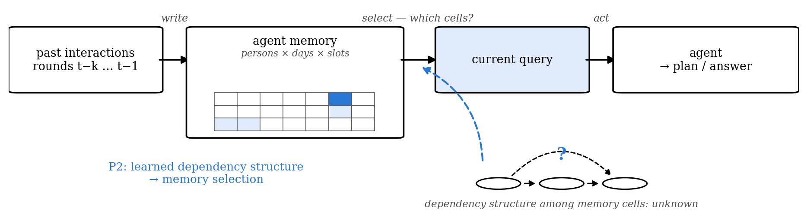
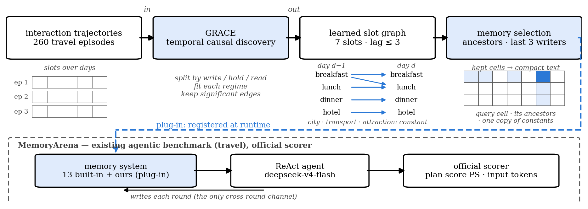
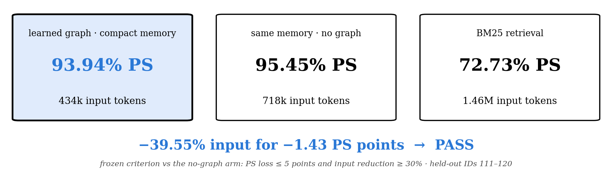
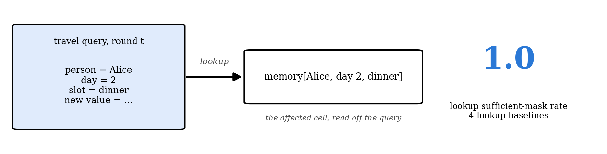
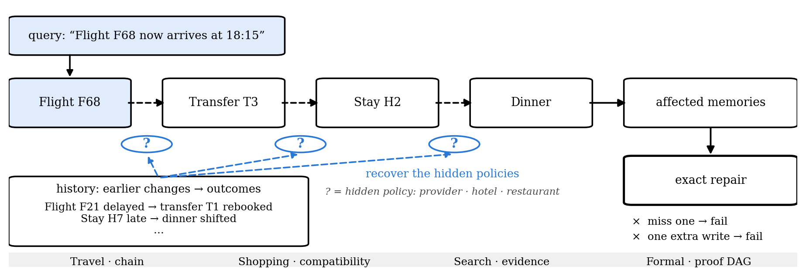
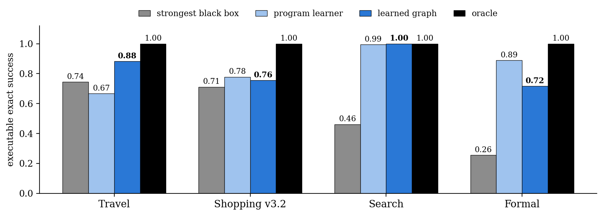
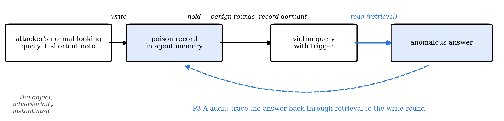
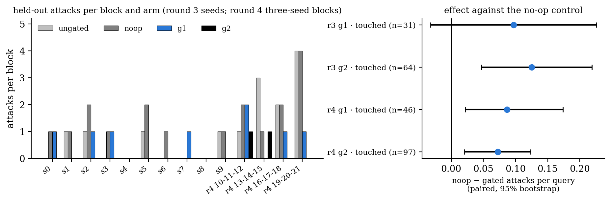
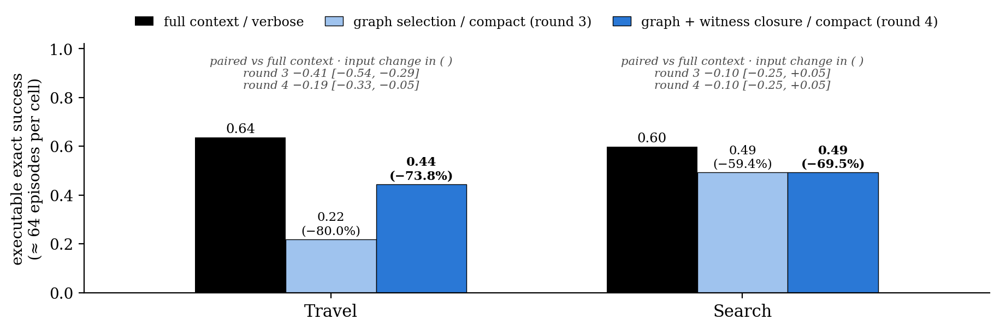
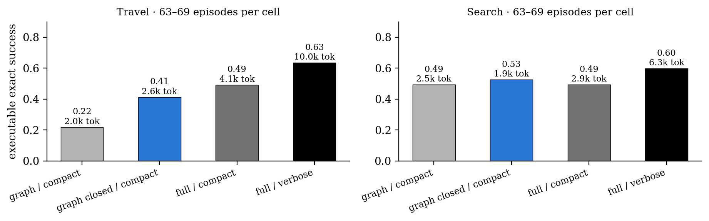

# Presenter script — Causal Memory deck (2026-09-03)

Speaking draft for all 21 slides of `slides/8-30_huaman_edit.pptx`. Numbers match
`docs/progress-report-2026-09-03.md`, including the API rounds 3–4 (§4.9) and the P3-B rounds 3–4
(§5.1) added on 9/3. Each slide has three parts: what is on screen, what to say, and what to
answer if asked. Timing without questions is about 27 minutes:

| block | slides | minutes |
|---|---|---|
| title and formulation | 1–4 | 5 |
| E0 simulation | 5 | 2 |
| P2 effectiveness | 6–11 (12 backup) | 9 |
| P3 trustworthiness | 13–17 (18 backup) | 7 |
| decisions (spoken, no slide) | — | 3 |
| appendix | 19–21 | only if asked |

---

## Slide 1 · Causal Memory

**On screen.** Title; "Memory = write → hold → regime-gated read (Layer 1, observed)".

**Say.** "Thank you for the time. This is the round-two report on causal memory. One sentence
for the whole project: memory is a write, a hold, and a regime-gated read over observed semantic
state, and one learned graph over that state has two uses, forward for selecting memory and
backward for auditing it. Today has four parts. The formulation, with the simulation you asked
for as its check. Then your first requirement, effectiveness, as two experiments on a real
benchmark. Then your second requirement, trustworthiness, on two real attacks. And at the end,
five decisions I need from you, including the venue."

---

## Slide 2 · formulation: what is written, held, and later read

**On screen.** A write at step t−k enters memory; the value persists through M_{t−k} … M_t; at
U_t = read the gated edge to the output Y_t opens. Discovery (E0) produces the learned graph Ĝ
with edges and gates; the graph feeds forward memory selection (P2) and backward auditing (P3-A).

**Say.** "The object first. Something is written into memory at some step. It is held: the value
persists across rounds and, while it is held, it has no effect on anything. Then the agent reads
it before acting, and only at that read step does the edge from the memory to the output become
active. That is the gate. Discovery recovers this as a graph with edges and gates. Then the same
graph is used twice. Forward: given the current query, which cells of memory does it depend on?
That is memory selection, P2. Backward: given a bad output, which write did it come from? That is
auditing, P3."

**If asked.**
- *Why call it a regime?* Because the same dependency can be present in one operation and absent
  in another. A memory cell drives the output only when it is read; while it is held it is inert.
  A single pooled graph cannot represent that.
- *Where is the latent layer?* Round 1 and round 2 are entirely Layer 1, observed semantic state.
  Layer 2 would be the same object over latent state; nothing today depends on it.

---

## Slide 3 · The formulation (Layer 1)

**On screen.** X_t = (X_t^1 … X_t^d) observed semantic slots; U_t ∈ {write, hold, read}; Y_t
the output. The equation x_j(t) = Σ_i Σ_{l=0..K} [a_ijl · g_ijl(u_t)] · x_i(t−l) + ε_j(t).
Temporal dependencies: l = 0 within a step, l ≥ 1 across steps, an unwritten slot persists.
Regime-dependent edges: the gate g(u_t) lets a dependency be active in write, hold or read.

**Say.** "Written out, it is a temporal structural model over observed slots. The l = 0 term is
the within-step dependency, the l ≥ 1 terms are the effects carried across steps; those are the
two functions you asked for on 7/29. During a hold, an unwritten slot copies itself. The one
addition is the gate: each coefficient is multiplied by a function of the current regime, so a
dependency can be active only during a read. Note the gate multiplies the coefficient. A model
that adds the regime as one more node only shifts the mean per regime and cannot represent an
edge that switches on and off. That difference is what the simulation on slide 5 tests."

**If asked.**
- *What is a variable, what is a sample?* A variable is one semantic slot, a fixed-schema slot
  in the benchmark (seven in travel; six event channels in MINJA; eight in the simulation). A
  sample is one episode, an independent trial. Effective samples are counted per edge × lag ×
  regime, because a gated edge only has data in the regime where it is active.
- *How many variables can this handle?* Everything in rounds 1 and 2 has under ten variables, far
  below GRACE's ~100-variable ceiling. The scaling simulation, d from 50 to 5,000 with MLP
  mechanisms, is proposed and not yet run; that is decision 6.
- *Is the estimator linear?* The instantiations that ran are: GRACE (causalts) on per-regime
  subsamples for the travel slot graph, and per-regime ridge with BH-FDR at α = 0.01 for E0 and
  MINJA. A nonparametric CD-NOD-style surrogate would be the fair comparison for a nonlinear
  additive-regime model; it is in the round-2 simulation plan.

---

## Slide 4 · The formulation (Layer 1): how do we recover the graph?

**On screen.** Four steps: split traces by write / hold / read; estimate dependencies within each
regime; combine significant edges; compare edge strengths across regimes to identify gated
dependencies.

**Say.** "The estimator follows from the model. Split the traces by regime. Estimate the
dependencies within each regime separately. An edge is reported if it is significant in any
regime. And an edge is called gated when its per-regime coefficients differ by at least four
times. The instrumented order of operations inside a step orients the lag-zero edges."

**If asked.**
- *Why 4×?* A fixed threshold frozen before the runs; the E0 gates and the MINJA read edge are
  far beyond it (MINJA seed 0: read coefficient 0.77 in-regime, p = 2.9e-6, versus 0.02 outside,
  p = 0.85).
- *Multiple testing?* BH-FDR at α = 0.01 within each regime for the ridge instantiation; GRACE's
  own selection for the travel graph.

---

## Slide 5 · Conditioning on write / hold / read reveals dependencies that pooling misses

**On screen.** Left: the E0 timeline, a write at t−Δ, a ten-step hold, a read at U_t = 1; the
read regime is 150 of 3,000 samples. Right: gated read edges recovered out of two: Regime-GRACE
2/2, blind PCMCI+ 0/2, additive u 0/2.

**Say.** "This is the simulation with known ground truth, the part you said we must do. A
synthetic write–hold–read model with eight variables. Two edges are active only when the memory
is read, and reads are five percent of the steps. Blind discovery, which pools over all steps,
recovers neither edge at three thousand steps: the read-only signal is diluted below the test
threshold. With twenty times more data it does find them, but it still cannot say when they act.
Treating the regime as one more additive node also recovers neither. Regime conditioning finds
both edges at three thousand steps and localises both gates to the read regime, and the result is
identical at every hold-noise level we tried. So detection is a sample-size problem, but the gate
is a model-class problem: no amount of data gives the pooled model the gate."

**If asked.**
- *The sweep numbers?* Blind PCMCI+: 0/2 at 3,000 steps, 1/2 at 12,000, 2/2 at 60,000, never a
  gate. Hold noise σ ∈ {0, 0.01, 0.1}, same result at each.
- *Why does additive-u fail here but work partly on MINJA?* Regime frequency. On E0 the read
  regime is 5% of steps and additive-u recovers 0/2; on MINJA the trigger regime is active in 69%
  of rounds and additive-u recovers 2/3. The gated model does not depend on that frequency.
- *Sources.* `results/regime_grace_e0.json`, `results/diagnostics/e0_blind_power_sweep.json`.

**Transition.** "That was the discovery side. Now the forward use of the graph, your first
requirement: effectiveness on a real benchmark. I will tell it as two experiments. The first asks
whether the learned graph is useful as memory. The second asks whether that usefulness comes from
the learned structure itself."

---

## Slide 6 · Can learned temporal structure make agent memory useful?

**On screen.** Past interactions are written into a memory of many cells (persons × days ×
slots); the current query needs only some of them; the agent acts on what it is given. Below, the
dependency structure among the cells is marked unknown, and P2 is the arrow from that structure
to the selection step.

**Say.** "Here is the problem in one picture. Over many rounds an agent writes into its memory,
and the memory grows into a large table of cells. At the current round a query arrives and the
agent has to act, but only a few of those cells matter for this decision. Which ones depends on
how the cells depend on each other over time, and that structure is not given. So the question is
simple: can a dependency structure learned from past trajectories tell the agent what to remember
for the current decision, so that it keeps the right cells and drops the rest?"

**If asked.**
- *Why is this a memory problem and not a retrieval problem?* Retrieval scores each cell by
  similarity to the query. The cells that matter here are the temporal ancestors of the query's
  targets, which similarity does not see.
- *Which benchmark and why?* MemoryArena, next slide. LongMemEval left no room for a graph (the
  causal ancestors are the answers and BM25 already scores 0.947) and became a diagnostic;
  MemoryAgentBench was dropped on setup cost.

---

## Slide 7 · GRACE as a memory module in MemoryArena

**On screen.** Top row: interaction trajectories → GRACE → learned slot graph → memory
selection, each with a small picture of what it holds: episodes as rows of cells over days;
GRACE's three steps; the learned graph (breakfast, lunch, dinner, hotel depend on their own
earlier values, lunch on breakfast; city, transport, attraction constant); the kept cells.
Bottom: the MemoryArena box with the memory-system slot where ours registers beside the 13
built-in systems, the ReAct agent, and the official scorer.

**Say.** "Two things need introducing, because you have not run them yourself. GRACE is the
temporal causal discovery method. It takes trajectories in, splits them by regime, fits the
dependencies within each regime, and returns a graph over the seven itinerary slots with lags up
to three. On the travel data it finds that the meals and the hotel depend on their own earlier
values, that lunch depends on breakfast three days back, and that city, transportation and
attraction stay constant within a trip. MemoryArena is an existing agentic benchmark. Its
important property for us is that the stored memory is the only channel between rounds; what the
agent remembers is what it can act on. It has a registry of thirteen memory systems and an
official scorer. We register ours as one more plug-in: the learned ancestors of the query's target
slots decide which cells are kept, the last three writers of each kept slot are retained, constant
slots are kept once, and the result is serialized compactly for the agent. The agent, the model,
the tools and the scorer are MemoryArena's own."

**If asked.**
- *How many episodes, how many variables?* 260 training episodes (the ten held-out episodes are
  excluded), seven slot types, lag ≤ 3.
- *Why GRACE?* Verified by implementation: GRACE (causalts) main, CDNOTS+ as baseline; UnCLe,
  CUTS+ and AVICI excluded as unusable here.
- *Did you modify MemoryArena?* No. Upstream has no license, so our system registers at runtime
  and the checkout stays clean.
- *Model and agent?* deepseek-v4-flash, ReAct with 12 steps, 32,768 max tokens, shared by every
  arm.

---

## Slide 8 · The learned graph works as a memory-selection structure

**On screen.** Three cards: learned graph with compact memory (93.94% plan score, 434k input
tokens), the same memory without a graph (95.45%, 718k), BM25 (72.73%, 1.46M). Below: −39.55%
input for −1.43 PS points → PASS, with the frozen criterion.

**Say.** "The result on ten held-out itineraries the graph never saw. The learned graph keeps the
plan score within a point and a half of the same memory without a graph, while sending forty
percent less input to the model. Against BM25 retrieval it is twenty points better at seventy
percent less input. The acceptance rule was frozen before the run: lose at most five points of
plan score and cut input by at least thirty percent. Both hold, so this is a PASS. The answer to
the first question is yes: the learned graph is a useful memory structure on a real agentic
benchmark."

**If asked.**
- *Is 93.94 versus 95.45 a loss?* Paired episode-mean −1.43 points, 95% interval [−4.29, 0.00],
  wins/ties/losses 0/9/1; inside the frozen five-point margin.
- *Why not long context?* 92.42% at 2.06 million input tokens, almost five times the graph arm.
- *How did you get here?* Three stages, all kept. On the first five IDs both graph arms scored 0%
  plan score, because the strict full-plan denominator fails a person on one wrong slot and 31 of
  37 persons failed only on slots the query never asked to change; that led to the
  query-target/base-inheritance decoder. On held-out IDs 101–110 the graph beat BM25 by +16.55
  points (main judgement PASS) but cut input by only 14.7% against the required 30%; that led to
  the compact serialization. Then this round on new held-out IDs 111–120.
- *What is bundled?* Graph selection and compact serialization sit in the same arm, so the token
  reduction is not attributable to the graph alone. One reason for the next slide.

---

## Slide 9 · But Travel did not require discovering the dependency

**On screen.** A travel query names person, day and slot; a lookup arrow leads straight to
memory[Alice, day 2, dinner]; the number 1.0 is the lookup sufficient-mask rate.

**Say.** "Before building on this, we audited what the result can and cannot show. A travel
query names the person, the day and the slot it changes. So the simplest possible method, read
the cell the query names and write the new value, already reaches every affected cell. We
measured this: four lookup baselines reach a sufficient-mask rate of one. That means the PASS
establishes that structured memory and compression are useful, and it does not establish that
learning the dependencies was necessary, because the query hands them over. The utility result
stands. What is missing is attribution, and that is what the second experiment is for."

**If asked.**
- *So the first experiment failed?* No. It answers the practical question, can the learned
  structure become a useful memory. The audit says it cannot answer the mechanistic question,
  whether learned structure is what made it work.
- *Anything else in the audit?* The inheritance decoder tests constrained editing rather than
  propagation, and selection and serialization were bundled.

---

## Slide 10 · Hide the dependency and require exact repair

**On screen.** The query names only the flight. The chain flight → transfer → stay → dinner has a
hidden policy on every edge. The history of earlier changes and their outcomes is the only place
those policies can be read. The task ends in an exact repair: miss one affected memory and fail,
write one unnecessary memory and fail. The strip names the four environments.

**Say.** "So we built a harder test where the query only tells you what changed. A flight now
arrives at 18:15. Whether the transfer follows automatically depends on the provider, whether the
hotel still holds the room depends on its late-arrival policy, whether dinner shifts or is
cancelled depends on the restaurant. None of these policies is shown to the agent. They differ by
entity, and the only place to learn them is the history: earlier changes and what happened
afterwards. By construction every policy the oracle uses is recoverable from one earlier outcome,
so the task is solvable, but only through the history. The agent must then repair exactly the
affected memories. Writes are not free: each one changes the state and the receipt, so missing a
memory fails, and updating one that did not need it also fails. Updating everything just in case
is not an option. We run the same task on four environments with different dependency structures:
a chain in Travel, compatibility and promotions in Shopping, evidence to claims in Search, and a
proof DAG in Formal."

**If asked.**
- *This environment is yours; did you give the model the rules?* No. Gate C1 checks that the query
  and the intervention name only the source; policies never appear as statements, only as
  outcomes; gate C3 shows that changing only the history changes the gold answer in 77–100% of
  paired episodes; gate C5 shows that an oracle reading only the history reaches 1.0.
- *What is the metric?* Executable exact success: every transaction legal, post-state equal to
  the oracle's, receipt equal to the oracle's. A transaction is {op, object, expected revision,
  payload}; each write bumps the revision, consumes a change token, charges a fee and drops the
  price lock, even when it rewrites the same value. One extra idempotent write fails 180/180.
- *Why four environments?* One question on four dependency structures. Shopping's version of
  record is v3.2; v3 leaked its policies through an initial state consistent with them and failed
  the killer-baseline check (0.567, 0.511); v3.2 draws promotions and accessories at random
  (0.461, 0.239) and passes all eight checks.
- *Anything tuned after test data?* Four rounds of feature revision on the two relational learners
  on dev seed 0 before the gate; test seeds and API outputs came after.

---

## Slide 11 · When dependencies are hidden, learned relational structure matters

**On screen.** Executable exact success on fresh test seeds, four environments, four methods:
strongest black box, program learner, learned graph, oracle.

**Say.** "Executable exact success on fresh test seeds. Four methods: the strongest black-box
predictor, a GNN with history-parsed estimates; a relational program learner; the learned graph;
and the oracle. The learned graph beats the strongest black box in all four environments, 0.88 on
Travel and 1.00 on Search. Its clearest advantage is Travel, where the effect of a change
composes over several hops and the values have to be propagated along the chain. Lookups, nearest
neighbours and a conservative superset, which are not on the chart, all stay at or below 0.46. So
when the dependency is hidden, learned relational structure with policies read from history is
what completes the repair."

**If asked.**
- *On Formal the program learner is at 0.89 and the graph at 0.72. Why?* Yes, and it is an
  important boundary. Given the same history-parsed policies, the per-object relational learner
  ties the graph on Shopping and Search and leads on Formal. What the data support is learned
  relational structure; the explicit graph form is not necessary everywhere, and its exclusive
  lead is the multi-hop numeric chain. Method problem or finding is decision 4.
- *How much data?* Train 200, evaluate 60 per seed, three fresh seeds (20–22), mean over seeds;
  dev seeds 0–2 and test seeds 10–12 give the same picture.
- *Does the LLM actually use this?* Appendix, slide 17. Short answer: at 64 episodes per cell the
  token reduction is 70–74% and the exact-success cost is 0.10–0.19, so it is a measured cost,
  and the LLM itself is far below the deterministic executor.
- *Program learner detail?* The regularised fit. The default gradient-boosting configuration
  collapsed on two Formal test seeds (0.15, 0.28) by failing to fit its own training episodes; the
  regularised configuration fits them all and is the version on the chart.

---

## Slide 12 · Setting (backup)

Skip in the talk. If asked: deterministic replication on Travel, Shopping v3.2, Search, Formal;
train 200 / test 60 per seed, seeds 20–22; five killers, four black boxes, program learner,
learned graph, two oracles; eight-check gate on dev seeds 0–2 before any output; CPU only. LLM
runtime: deepseek-v4-flash at temperature 0, Travel and Search, 20 episodes per cell in rounds
1–2 and about 64 per cell in rounds 3–4, five selections × two serializations, round 4 adds
witness closure, four rounds for $32.1.

**Transition.** "That is the forward use: the learned graph is a useful memory, and when the
dependency is hidden, learned structure is what completes the repair. Now the backward use of the
same graph, your second requirement: recovering a hidden driver of the agent's decisions."

---

## Slide 13 · Memory poisoning gives us a hidden driver to recover

**On screen.** Attacker's normal-looking query with a shortcut note → poison record in agent
memory (write) → benign rounds, record dormant (hold) → victim query with trigger → anomalous
answer (read, retrieval). The dashed blue arrow is the audit: trace the answer back through
retrieval to the write round.

**Say.** "For trustworthiness we needed a hidden driver of an agent's decisions, and memory
poisoning is exactly our object, adversarially instantiated. An attacker writes a poisoned record
through a normal-looking interaction. It stays dormant through many benign rounds. Later a query
with a trigger retrieves it and the agent produces a bad answer. Behavioural auditing only sees
that bad answer. Our audit task is to trace it back: which retrieved record drove it, and which
write round that record came from. That is the backward use of the same write–hold–read graph."

**If asked.**
- *Why attacks rather than a constructed scenario?* You offered both on 8/21. E0 is the
  constructed case; the two attacks are existing work modified to expose the pathway, which is
  the stronger test.
- *Why not the EHR-style carrier?* Off-limits for this project; MINJA-QA and AgentPoison were
  chosen instead.

---

## Slide 14 · Test auditing on two memory-based agents

**On screen.** MINJA: an attacker plants a shortcut note through normal interactions; later
queries retrieve memories by Levenshtein top-3, so the full write → hold → read → output pathway
is observable; a QA agent on one MMLU subject; 3 seeds × 81 rounds. AgentPoison-StrategyQA: a
frozen DPR index of 9,253 passages with two poisoned records; each ReAct search retrieves the
top-1 passage; a trigger may surface a poisoned record; poison labels hidden during auditing.

**Say.** "Two carriers, both on deepseek-v4-flash, chosen to vary the memory and retrieval
mechanism. MINJA is a QA agent with an online episodic memory. The attacker plants a shortcut
note through ordinary queries, and later queries retrieve by string similarity, so we can
instrument every stage from the write to the answer: three seeds, eighty-one rounds each, six
event channels per round. AgentPoison is the opposite setting: a frozen retrieval index of about
nine thousand passages with two poisoned records, a ReAct agent that retrieves the single top
passage per search, and a trigger that may surface a poisoned one. Here the poison labels are
hidden during the audit and attached only afterwards for scoring. MINJA tests full temporal
provenance; AgentPoison tests label-free record attribution. MemAudit is reimplemented as the
detection baseline."

**If asked.**
- *Decoding?* MINJA T = 0.5, AgentPoison T = 0, top-p = 1 for both.
- *Which event channels?* Six binary channels per round, including whether a poison record was
  retrieved and whether the answer was anomalous. The poison-retrieved channel is built from the
  record's is_poison tag, which is a stated boundary (slide 15).
- *What does MemAudit score?* Our reimplementation: CMIS macro AUC 0.866, precision@k 0.874. Our
  claim is temporal ancestry and one graph with two uses, not a better detection score.

---

## Slide 15 · Results

**On screen.** Left half of the P3 figure: MINJA seeds recovering the hidden read edge
poison-retrieved → anomalous: Regime-GRACE 3/3, blind PCMCI 0/3, additive u-node 2/3,
regime-subsampled 1/3. AgentPoison: driver direct 1/2, with the frozen expansion 2/2.

**Say.** "On MINJA the hidden dependency from poison-retrieved to anomalous answer is recovered in
three of three seeds, gated in two. Because the memory is instrumented from the moment it is
written, we can then trace an anomalous answer through retrieval back to the original write round:
full provenance. The discovery baselines on the same traces: blind PCMCI zero of three, the
additive regime node two of three, regime subsampling one of three. On AgentPoison, direct
temporal attribution identifies one of the two poisoned records without any poison label, and a
pre-frozen embedding-cluster expansion with k = 2 recovers both. So the hidden read edge and the
write ancestry are recoverable on a real attack, and the record attribution works without labels."

**If asked.**
- *Boundaries?* Two, stated. MINJA's poison-retrieved channel is oracle-tagged, so the recovered
  structure sits on an instrumented event channel, and record discovery on MINJA stays outside
  the claim. The AgentPoison expansion had no pre-registered standalone PASS.
- *Per-seed?* Seed 0: held-out attack success 6/12, decisive cell 12/37, edge found and gated;
  seed 1: 1/12, 6/31, found and gated; seed 2: 1/12, 4/8, found without the gate flag. The pathway
  reproduces; its strength is seed-dependent.
- *Is this actionable, or only interpretive?* Two answers. Replay-only: the ancestry-plus-regime
  gate covers 95.3% of anomalous rounds on saved trajectories at 8.8% collateral, versus 97.2% at
  40.4% without the regime condition. Online: P3-B, next question.
- *What about online mitigation (P3-B)?* Next two slides. Round 2 failed its frozen rule on both
  carriers and is kept as a FAIL; the power audit located the causes; rounds 3 and 4 on MINJA
  close the exposure gap and round 4 passes.

---

## Slide 16 · Test online mitigation with a no-op control

**On screen.** Prose, same shape as slide 14. Calibration scores records without poison labels;
round 2 deleted only the implicated ones and about half of the memory was never retrieved during
calibration. Two deletion policies: g1 adds every record written on the same question stem as an
implicated one; g2 adds a quarantine of unvetted records in the trigger regime. Four arms per
held-out query from one frozen memory: ungated, no-op (empty deletion set), g1, g2. Round 3: ten
seeds × 12 rounds. Round 4: fresh seeds 10–21 in four three-seed blocks, frozen before its first
call; a block counts when its gate-free arms hold at least three attacks.

**Say.** "Auditing recovers the ancestry; mitigation asks whether deleting it helps on new calls.
Round two deleted only the records calibration had scored, and the audit showed why that could
not work: half of the memory was never retrieved during calibration, so poison records the driver
had never seen survived every threshold. Round three keeps the label-free driver and fixes the
exposure. The first policy, g1, treats an implicated record as evidence about the whole question
stem it was written on, because that is how this attack writes memory: escalating notes on one
question. The second, g2, goes further and withholds anything unvetted whenever the query is in
the trigger regime. Every held-out query is answered four times from one frozen memory: ungated,
a no-op arm that runs the identical pipeline with nothing deleted, g1 and g2. The no-op arm is
the point: paired LLM calls flip answers on their own, so the effect of a policy is only what it
changes relative to no-op. Round three used ten seeds of twelve rounds; round four, frozen before
its first call, used fresh seeds in three-seed blocks so that blocks are large enough to judge."

**If asked.**
- *Why blocks of three seeds?* Only 31 victim questions exist in the subject, so a seed holds 12
  held-out rounds; at a 3–8% base attack rate a 12-round block rarely holds two attacks. The
  round-4 block design was frozen after an interim look at five round-3 seeds; disclosed in the
  protocol.
- *Is the expansion label-free?* Yes: question text only. Poison labels are attached after every
  decision, for precision and recall.
- *Deletion semantics?* Round 3 deletes from memory and then retrieves top-3 from what remains;
  round 2 deleted from the retrieved list without backfill.

---

## Slide 17 · Deleting the recovered ancestry and its same-stem records mitigates the attack

**On screen.** Left: attacks per block and arm for the ten round-3 seeds and the four round-4
three-seed blocks. Right: paired effect against the no-op control on touched queries, rounds 3
and 4, g1 and g2, with 95% bootstrap intervals.

**Say.** "Round three showed the direction: the quarantine arm removed every attack in one
hundred and twenty rounds at the best accuracy of the four arms, and its paired effect against
no-op excluded zero. But the attack was rare that round, three to eight percent, so no twelve-round
block held two attacks and the frozen block rule could not be evaluated; that round is a FAIL and
stays one. Round four, on fresh seeds in three-seed blocks, is the confirmatory result. All four
blocks are evaluable. Against the no-op control, g1 cuts attacks from nine to four per hundred and
forty-four rounds and improves three of four blocks; g2 cuts them to two, again three of four, at
the highest accuracy of the four arms. Both pass the pre-registered judgement. The effect is small
in absolute terms because the attack is rare against this model; relative to what the same memory
produces without the gate, it removes about half to four fifths of the attacks."

**If asked.**
- *Numbers?* Round 4: attacks per 144 rounds ungated 10, no-op 9, g1 4, g2 2; accuracy 0.83 /
  0.80 / 0.85 / 0.87; paired on touched queries g1 +0.087 [+0.022, +0.174] (n = 46), g2 +0.072
  [+0.021, +0.124] (n = 97). Round 3: ungated 4, no-op 9, g1 4, g2 0 per 120; g1 +0.097
  [−0.032, +0.226] (n = 31), g2 +0.125 [+0.047, +0.219] (n = 64). Pooled 22 seeds: g1 +0.091
  [+0.026, +0.169], g2 +0.093 [+0.050, +0.143].
- *Boundaries?* One carrier and one model. Mitigation evidence does not upgrade P3-A's recovery
  evidence. Rounds 2 and 3 remain FAIL in the record.
- *AgentPoison?* Round 2's failure there was a power artifact (two of three blocks had no attacks;
  the evaluable block improved 1/1). A round 3 is blocked in our environment: no network path to
  the StrategyQA dev split or the DPR encoder. About 600 trajectories, roughly $5, once the
  network allows.

---

## Slide 18 · Setting (backup)

Skip in the talk. If asked: MINJA-QA on deepseek-v4-flash, T = 0.5, QA agent with episodic
memory, Levenshtein top-3, online written memory, 3 × 81 rounds, purpose full write → read
provenance. AgentPoison on deepseek-v4-flash, T = 0, 7-step ReAct, DPR top-1, frozen
9,253-passage index, 64 calibration plus held-out trajectories, purpose label-free record
attribution.

---

## Decisions to raise (spoken; no slide)

**Say.** "Five decisions, then the venue."

1. **Formulation.** Build the paper on write → hold → regime-gated read with the honest P2 claim:
   learned relational structure plus history-parsed policies completes repair, and the graph form
   is exclusive on compositional chains?
2. **Shopping.** Keep v3.2 (initial state independent of the hidden policies) as the version of
   record and retire v3?
3. **LLM runtime.** Rounds 3–4 settled the power question: at 64 episodes per cell the input
   saving is 70–74% and the exact-success cost is 0.10–0.19. Report that cost as measured, or
   invest in a stronger runtime before submission?
4. **Formal.** Graph 0.72 versus program learner 0.89: a method problem to solve before
   submission, or a finding to report?
5. **P3-B.** Round 4 passed on MINJA with its boundaries stated; rounds 2 and 3 stay FAIL in the
   record. Does mitigation enter the paper as a supported-with-boundaries result, and is an
   AgentPoison round worth running once the network allows?
6. **Scale.** Run the d = 50 → 5,000 simulation with MLP mechanisms as the next simulation round?
7. **Venue.** ICLR 2027: abstracts Sep 18, papers Sep 25 (AOE). That makes 3, 5 and 6 this
   week's decisions.

---

## Slide 19 · Appendix — the LLM runtime: selection × serialization (only if asked)

**On screen.** Travel and Search, about 64 episodes per cell: full context / verbose (0.635,
0.597), graph selection / compact from round 3 (0.219 at −80.0% input, 0.493 at −59.4%), graph
with witness closure / compact from round 4 (0.444 at −73.8%, 0.493 at −69.5%); paired
differences against the full context above each group.

**Say.** "We also measured selection on the runtime that will use it. The first two rounds, at
twenty episodes per cell, were inconclusive: the intervals crossed zero and the point rule
flipped between rounds. So round three re-ran the main cells at eighty episodes per cell, and
round four closed the selection by adding the objects the witness records name, because in most
failing Travel episodes the witnesses pointed at objects the selection had dropped. The closure
recovered half of Travel's gap. At this sample size the verdict is stable: graph selection cuts
input by seventy to seventy-four percent at an exact-success cost of 0.10 to 0.19, and
non-inferiority at the 0.10 margin is not met. The runtime itself is the bottleneck: the
deterministic graph reaches 0.86 on Travel and 0.99 on Search where the best LLM cell reaches
0.64. So the token reduction is established, the cost is measured, and a stronger runtime is the
open item."

**Numbers if pressed.** Travel: round 3 −0.413 [−0.540, −0.286], round 4 −0.190 [−0.333,
−0.048], closure gain +0.234 [+0.094, +0.359]. Search: −0.104 [−0.254, +0.045] in both rounds.
Round 3 hit its $12 cap at 527 of 640 cells (63–69 per cell); round 4 cost $6.41 with no
infrastructure failures; four rounds total $32.1. Rounds 1–2 pooled: Travel −0.125 [−0.325,
+0.075], Search −0.025 [−0.200, +0.175].

---

## Slide 20 · Appendix — the LLM needs the objects its witnesses name (only if asked)

**On screen.** Travel and Search, 63–69 episodes per cell: exact success and input tokens per
episode for graph / compact, graph closed / compact, full / compact, full / verbose.

**Say.** "This is why the graph selection lost on Travel in round three. Its witness records were
all there, but they named objects the selection had dropped: the model saw a transfer move by
some minutes and could not see that transfer's provider, so it could not key the policy. Adding
the objects the witnesses name, and their neighbours, recovers half of the gap at a quarter of
the full input. On Search the closure changed nothing. The remainder is the runtime's use of a
minimal evidence set: the deterministic executor, which always sees the full state, reaches 0.86
and 0.99 on the same episodes."

**Numbers if pressed.** Travel closure gain +0.234 [+0.094, +0.359] (n = 64); closed vs full
−0.190 [−0.333, −0.048]. Search closed vs full −0.104 [−0.254, +0.045]; closure gain 0.000.

---

## Slide 21 · Appendix — what we can write, and the decisions (only if asked)

The two lists on the slide are the claim ledger of `docs/progress-report-2026-09-03.md` §6 and
the seven decisions above. Read them straight.

---

## Number sheet

| item | value |
|---|---|
| E0 | 8 variables, 3,000 steps, read regime 150/3,000; Regime-GRACE 2/2 edges and 2/2 gates at every σ ∈ {0, 0.01, 0.1}; blind PCMCI+ 0/2 → 1/2 at 12k → 2/2 at 60k, never a gate; additive u 0/2 |
| MemoryArena held-out IDs 111–120: graph / no graph / BM25 / long context | PS 93.94 / 95.45 / 72.73 / 92.42; input 434k / 718k / 1.46M / 2.06M; SR 70 / 80 / 30 / 80%; cost $4.30 / $5.11 / $15.31 / $8.20 |
| Paired PS, graph − no graph; − BM25; − long | −1.43 [−4.29, 0.00] 0/9/1; +19.80 [+10.04, +29.70] 7/3/0; +1.07 [−4.29, +7.50] 1/8/1 |
| Frozen criterion | PS loss ≤ 5 and input −30% → PASS (−1.43, −39.55%) |
| Earlier rounds | IDs 1–5: PS 0% both arms; IDs 101–110: +16.55 vs BM25 [+9.17, +25.24] 8/2/0, input −14.7% (secondary FAIL) |
| Learned slot graph | 7 slots, lag ≤ 3, 260 episodes; self-lags on breakfast, lunch, dinner, accommodation; breakfast → lunch (lag 3); city, transportation, attraction constant |
| Audit | four lookup baselines, sufficient-mask rate 1.0 |
| HM3 gate | C3 pairs differ 0.77–1.00; C6 180/180; killers ≤ 0.46 (Shopping v3.2), lower elsewhere; Shopping v3 failed C4 (0.567, 0.511) |
| HM3 fresh seeds, Travel / Shopping v3.2 / Search / Formal | best lookup 0.06 / 0.46 / 0.17 / 0.03; kNN 0.30 / 0.26 / 0.41 / 0.07; superset 0.01 / 0.00 / 0.28 / 0.07; GNN+est 0.74 / 0.71 / 0.46 / 0.26; program 0.67 / 0.78 / 0.99 / 0.89; graph 0.88 / 0.76 / 1.00 / 0.72; oracles 1.00 |
| LLM rounds 3–4 | input −70–74%; EES cost 0.10–0.19; Travel r4 −0.190 [−0.333, −0.048]; Search −0.104 [−0.254, +0.045]; four rounds $32.1 |
| MINJA | read edge 3/3 seeds (gated 2/3); baselines blind PCMCI 0/3, additive u 2/3, regime-subsampled 1/3; replication ASR 8/36, Wilson [0.117, 0.381]; note-free control 0/77 |
| AgentPoison | driver direct 1/2, frozen k = 2 expansion 2/2; MemAudit baseline CMIS AUC 0.866, precision@k 0.874 |
| Replay-only gate | ancestry + regime 95.3% coverage / 8.8% collateral; no regime 97.2% / 40.4%; CMIS + regime 36.4% / 2.9% |
| P3-B round 2 (FAIL) | MINJA 6/36 → 5/36; AgentPoison 3/72 → 0/72, no-op 4/72; 1/3 blocks improved on each |
| P3-B round 3, MINJA (FAIL, blocks unevaluable) | ungated 4/120, no-op 9/120, g1 4/120 (+0.097 [−0.032, +0.226], n = 31), g2 0/120, accuracy 0.89, +0.125 [+0.047, +0.219], n = 64 |
| P3-B round 4, MINJA (PASS both) | ungated 10/144, no-op 9/144, g1 4/144 (+0.087 [+0.022, +0.174], n = 46), g2 2/144 (+0.072 [+0.021, +0.124], n = 97); 4/4 blocks evaluable, 3/4 improve under each; accuracy 0.83 / 0.80 / 0.85 / 0.87; pooled 22 seeds g1 +0.091 [+0.026, +0.169], g2 +0.093 [+0.050, +0.143] |
| Venue | ICLR 2027: abstracts Sep 18, papers Sep 25, 2026 (AOE) |
