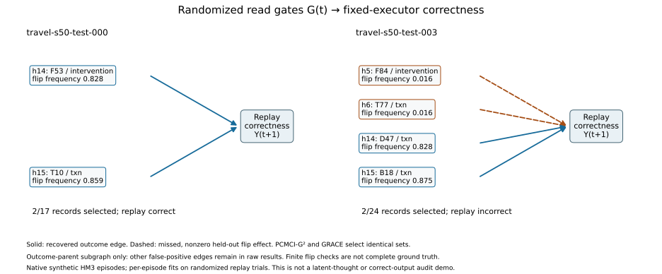

# 与 Yujia 方向对齐：执行结果与当前结论（2026-09-21）

这轮完成了代码核验、关键对照、一次冻结后的读取规则修正、真实 LLM 调用，
以及一个新的标准 discovery 输入方案。**有可复现的正结果，但尚不能说已经
满足“恢复可靠时间结构，并自然带来记忆与可信审计收益”的完整要求。**
此页与 [完整报告](../results/real/hm3/alignment/report.md) 优先于旧状态文档的叙事。
本页是本地讨论稿，未向 Yujia 发送任何消息。

## 1. 最新 causal discovery 要求，究竟完成到了哪里？

原实现的准确描述是：在**对象类型的二值写入指示序列**上做 pooled lagged
regression，使用 BH-FDR 筛选；此外确实接入并运行了 PCMCI+ 和 GRACE 官方实现。
这些估计的是该编码下的类型级时序依赖，不是原文档中的逐字段 SCM，也不是
潜在思想的恢复。GRACE 包装层还未使用原回归使用的外生干预行掩码，不能说
各算法的干预处理完全一致。

尤其要注意，event 编码中每条记录只激活一个类型，产生互斥/和约束，同时
没有把字段数值作为 discovery 变量。这是表示层面的限制，不能假定换成
2025/2026 的算法就自动恢复字段机制；也不能把这种观察直接升级成所有
观测估计量都不可能识别的定理。

但“接入成功”不等于“发现的结构有贡献”：

- 已完成 Travel / Shopping、seeds 30/31/32、四种历史条件，共 24 格，
  1,536 次请求、1,531 个有效 episode-condition 评估。
- **GRACE-open/parser 与 complete/parser 在 1,531/1,531 个评估中完整序列化
  输入相同。** Complete 保留给定实例链接与 parser，但不学习或筛选类型边。
  因而这些结果不能证明 learned type filtering 的收益。
- 稀疏一些的 GRACE-open×3 只在 1,278/1,531 个输入上相同；不能把两个配置
  混写为“GRACE 都与完整图相同”。其不同输入已通过新 actor 小样本检查，
  并未证明更好的效果。
- 原来的五边 reference 是 `LearnedGraph` 的类型路径投影，并非直接机制真值。
  例如 Travel 的 bundle 更新实际上依赖 `dinner_changed`，不能只拿
  `stay→bundle` 当作直接真边。

因此，旧“成熟 TCD→类型图→选读”的效果主张需要重做实证支撑，不能靠换叙事
继续沿用。坏图失败、query-only 失败，均不能推翻上述 complete 对照。

## 2. 已经拿到的可靠正结果

### A. 不依赖手写参数解析的读取规则修正

实现了 `component_key2`：使用可见的实例链接、同 key 的先例和时间顺序，优先
当前连通分量中的响应先例，保留完整 segment。不访问 gold actions、隐藏参数
或 required-read 标签。开发 seed 上定好规则后，固定在新 seeds 40/41/42 评估；
两域共 18 格、1,152 次评估，没有根据这些测试结果再调规则。

| 条件 | 原 key2 | component_key2 | 配对增益 95% CI | 平均读取记录数 |
|---|---:|---:|---|---|
| Travel c100，n=192 | 88.0% | 92.2% | +4.2 pp [1.0, 7.3] | 18.5 → 19.9 |
| Travel 500，n=192 | 81.3% | 90.1% | +8.9 pp [4.7, 13.0] | 20.1 → 21.4 |
| Shopping 500，n=192 | 95.8% | 100.0% | 详见完整报告 | 37.4 → 30.7 |

这些都是**固定 executor 的结果**，算法是使用给定链接的检索规则，不是 causal
discovery。它可能受益于当前合成任务把部分干扰放在不同连通分量的设计。
置信区间按 episode 配对、在 seed 内重采样，只条件于已评估的三个 seed。

新 LLM 诊断使用原 v1 / verbose / 16,384 输出上限，Travel seeds 30/31/32，
c100 与 500 各 23 个有效 episode，12 条臂，共 430 个不同完整输入的调用。
相同 episode 内完全相同输入共享调用，不当作独立重复。

| LLM 臂 | c100，n=23 | 500，n=23 |
|---|---:|---:|
| component_key2 | 56.5% | 30.4% |
| 原 complete/key2 | 34.8% | 21.7% |
| complete/parser | 39.1% | 47.8% |
| full history | 21.7% | 30.4% |
| BM25-16 | 26.1% | 13.0% |
| recency-16 | 30.4% | 26.1% |

c100 的 component_key2 − full 为 +34.8 pp [13.0, 56.5]，但 full 有 4/23
首轮截断，component_key2 没有；500 上二者持平。这个小型诊断不能替代原
64-episode 主表，也不能据此宣称跨条件稳定的 LLM 提升或因果结构贡献。
完整报告包含 query-only、三个预先固定的错误图、匹配随机读取和截断信息。

### B. 新方案：在随机读取数据上运行标准 discovery

为避免旧类型图被给定实例链接“架空”，实现了一个**更换研究对象的候选方案**：
固定一个 HM3 episode 和 executor，独立随机化各记录的可见性 `G_i(t)`，
重放并记录正确性 `Y(t+1)`，再运行标准 PCMCI+ / GRACE。

样本是重放试验；变量是各记录的读取开关与正确性；一个 fit 内变量固定。
这个 lag 是“试验输入→下一行的试验结果”，不是原 agent 的写入时间轴。
它没有恢复 latent state，也没有重新识别完整 write/hold/read regime。
训练正确性来自 benchmark oracle，因此尚不是无标签的部署方法。

开发阶段后，固定设置评估新 seeds 50/51/52、每个 4 个 episode。每个 episode
独立拟合，用 512 次随机读取试验，另用 64 个独立上下文/记录做翻转效果检查。

| 方法 | 选出集合后正确重放 | 平均读取数 | 对应同记录数随机读取 |
|---|---:|---:|---:|
| PCMCI+ ParCorr | 7/12 | 3.42 | 9/36 |
| GRACE + PCMCI-G² | 11/12 | 3.83 | 9/36 |
| PCMCI-G² 单独（事后归因检查） | 11/12 | 3.83 | 与上一行相同集合 |

原历史平均 18.25 条；全读 12/12 正确，空读 0/12 正确。这是保持多数任务
正确性的选读结果，并不是相比全读提高了正确率。随机对照每 episode 三个，
先在 episode 内平均再算配对 CI，不把 36 个随机集合当作 36 个独立样本。
GRACE/G² 相比该随机均值为 +66.7 pp [50.0, 80.6]；只有 12 个 episode，
不把这个区间外推到一般任务。

最重要的归因与边界：

- **PCMCI-G² 单独复现了 12/12 个 GRACE 的 outcome-parent 集合。**
  目前没有神经 refinement 额外有用的证据。ParCorr 对比还改变了检验与 alpha，
  不能把 7/12→11/12 归于 GRACE 神经网络。
- GRACE 的 36 个随机对照中，31 个是精确代理 token 匹配，其余最大差 11 tokens
  （约 2.6%）；8 个随机集合恰好与方法集合相同，全部保留。使用的是
  `cl100k_base` 代理，不是模型真实 tokenizer。
- 只验证了 outcome 的候选父节点。算法还在随机化 gate 之间产生了虚假边：
  ParCorr 共 24 条，GRACE 共 91 条。因此不能宣称恢复了正确的完整时序图。
- 在 `travel-s50-test-003`，两个方法都漏掉了两个低频依赖，选出的两条记录
  不足以正确执行。独立翻转检查中的低频效应是 1/64，不能当作已知完整真值。
- 这些结果来自逐 episode 拟合的确定性 executor；没有跨 episode 摊销、
  LLM 效果或现实任务验证。共 16,622 个去重 executor 上下文（含诊断/对照），
  总 episode 计时约 210 秒，不含事后前置筛选核验。

实际结构图同时展示固定的首个测试例与失败例，不是挑最好的图：



这张图是读取依赖示意，**不是** Yujia 所要求的“输出正常但依赖违规记忆”审计演示。

## 3. 可信审计：做了，但没有通过，不能写成成功

第一次冻结的 case 使用 executor 提议的可疑记录，在 LLM 上 baseline、删可疑
记录、删中性记录、修改可疑数值均正确 3/3，未证明 LLM 依赖该记录。

第二次使用 actor 自己的重放寻找子集，并做独立验证：full 0/3 正确、候选
子集 2/3、屏蔽来源 1/3。未得到稳定的“正常正确输出依赖问题来源”证据。
失败后没有继续更换案例。来源权限是场景中外部给定的标签，不能从边或集合
成员身份推断 agent 在撒谎。

这不是可以直接删掉的附属部分：它仍然是 Yujia 设想中的重要收益，目前未完成。

## 4. 当前应保留、停止和确认什么

- 保留：已有仿真、完整日志、可复用的 baseline 接口、真实 LLM 数据和
  `component_key2` 的新 seed 检索增益。
- 停止使用：旧类型图的 discovery-benefit 结论；Shopping v2 截断混杂的
  accuracy headline；把任意 replay 子集等同唯一 causal frontier；通用
  `O(k log n)` ddmin 保证；把正确子集或输出错误追责当作已完成可信审计。
- 候选重做方向：先用标准 PCMCI-G² 的随机读取依赖，明确其干预、oracle 标签、
  样本和 policy 范围。当前数据不支持为突出 GRACE 而增加方法复杂度。
- **需要与 Yujia 确认的研究选择**：是否接受把 layer 1 当前实证对象收窄为
  “可观测读取开关→固定策略决策”，还是必须继续研究原轨迹内的 memory 状态
  与写入时序结构。两者不是同一问题；我没有把候选方案默认为她已认可的主线。
- baseline 尚有缺口：这一轮补了 BM25、recency 和结构控制的同协议 actor 诊断，
  没有新跑 Mem0/A-Mem/LightMem。旧结果不能直接拼进新表。主线确定后，仍需
  用同一接口、prompt、seed、输出策略补有代表性的 memory-system 对比。

## 5. 复现与成本

代码入口：`hm3.structure_alignment`、`hm3.reader_repair`、`hm3.alignment_actor`、
`hm3.read_gate_tcd`、`hm3.read_gate_attribution`。`component_key2` 已接入原
`hm3.llm.Selector` 与 `hm3.scaling` runner。

```bash
PYTHONPATH=code python3 -B -m hm3.merge_alignment_controls
PYTHONPATH=code python3 -B -m hm3.alignment_report
PYTHONPATH=code python3 -B -m hm3.alignment_figure
PYTHONPATH=code python3 -B -m unittest hm3.test_structure_alignment
git diff --check
```

原始结果位于 `results/real/hm3/alignment/`；开发结果单独在
`results/development/hm3/alignment/`。旧结果没有删除或改写成新方法的结果。

API 使用用户提供的忽略目录中的文件，未把密钥写入实验结果。按仓库旧费率
计算的 ledger 合计约 **$27.35**：有效 actor 诊断 $15.97，已停止的接口不完整
pilot $10.69，两次审计共 $0.69。这不是实际账单；连通性检查及停止时仍在途
但未记录的请求可能另计。第一个 pilot 因缺记录 referent 的可见对象上下文被
明确判为无效比较，数据保留，不并入有效 actor 结果。

## 6. 用户追加：近期 causal discovery 方法

已根据用户澄清，将“causal”理解为因果发现而非英国团队。候选核验与冻结的
新实验见 [其他方法协议](causal-discovery-alternatives-2026-09-21.md)。UnCLe
（NeurIPS 2025）的官方入口已接入，开发和 12 个新测试均已完成；新测试使用
完全不同的 seeds 60/61/62。LCM（2026）、TGES（2025）、SPACETIME（AAAI 2025）分别
检查变量上限、分布假设与实现，不把文献筛选写成已跑实验。

这轮扩展不增加 LLM API 调用、不替换前文第一轮数据，也不默认改变论文主线。

UnCLe permutation 固定读 8 条时 11/12 正确，相应匹配随机为 16/36；读
2/4 条时只有 2/12、4/12。事后同记录预算的 PCMCI-G² ranking 也为 11/12，
**没有显示 UnCLe 的额外优势**。这支持继续研究可验证的读取依赖，而不是
必须把 GRACE 或 UnCLe 作为不可替代的方法核心。详见
[独立新方法报告](../results/real/hm3/alignment/uncle_report.md)。
