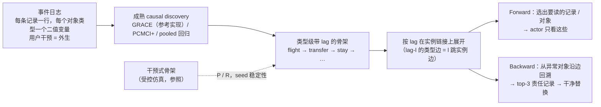

# 给 Yujia：成熟因果发现算法 → 同一条 pipeline（2026-09-20 会后一页）

> **2026-09-21 核验修正：本页保留历史实验记录，不作为“已满足要求”的结论。**
> GRACE 确实运行并接入，但开放图在 Travel 接近全连接；保留原实例链接和
> parser、取消类型边筛选，也能得到相同读取。新对照见
> `structure-alignment-protocol-2026-09-21.md` 与 `results/real/hm3/alignment/`。
> 参照的五条边是 LearnedGraph 的路径投影，不是逐条核验的直接机制图。
> GRACE 原文 Appendix B 明确不提供完整非线性模型的 identifiability 保证。

会上的结论：pipeline 完整；"causal" 这个词要站得住，结构发现必须能由成熟的 causal discovery 算法在同一批日志上得到。下面是照这个顺序做完的结果：GRACE / PCMCI+ 跑同一批日志 → 与干预式骨架比图恢复 → 把恢复的图插进已有的 forward selection 与 backward provenance → 判断是否需要重跑 actor。没有为了让某个方法"赢"而调参；Shopping 按边界如实报。

## 一张图

三个部件一个字没改：选择执行器、provenance 回溯、actor prompt。换的只是骨架来源。

## 第一组：结构恢复（边 P / R 对干预式骨架，6 seed：dev 0/1/2 + test 30/31/32）

| 方法 | Travel（5 条真边） | Shopping32（3 条真边） | seed 稳定性 | 门值排序 AP（Travel / Shopping） |
|---|---|---|---|---|
| pooled 回归 + BH-FDR（我们原来的估计量） | 0.21–0.23 / 1.00 | 0.50 / 1.00 | 6/6 全召回 | — |
| GRACE，开放骨架，公式 λ | 0.19 / 1.00 | 0.50 / 1.00 | 6/6 全召回 | 0.47–0.63 / 0.70–1.00 |
| GRACE，开放骨架，3×λ | 0.24–0.29 / 0.80–1.00 | 0.50–0.60 / 1.00 | 链头 6/6，链尾 5/6 | 0.56–0.62 / 0.92–1.00 |
| GRACE，开放骨架，10×λ | 0.40–0.75 / 0.40–0.80 | 1.00 / 0.33–0.67 | 只剩链头 | 0.59–0.77 / 0.87–1.00 |
| GRACE + PCMCI+ 骨架 | 0.20 / 0.40 | 0 / 0 | 6/6 相同 | 0.27–0.50 / 1.00 |
| PCMCI+ ParCorr / G² | 0.20 / 0.40；0.25–0.40 / 0.40 | 0 / 0 | 6/6 相同 | — |

读法。所有方法在全部 seed 上都恢复链头 flight → transfer → stay（GRACE 门 0.84–0.88）。条件独立检验把链尾（dinner、activity、bundle）归到 flight 的 lag 2–3 并剪掉中介边：中间写入是 flight 写入的确定性函数，条件在前一步写入上后一步就冗余了——这是 E0 在 hold regime 记录过的 faithfulness 失效，现在在 agent 日志上再次出现，且 ParCorr 与 G² 一致，说明是日志的性质。开放骨架的 GRACE 在每个 seed 上把链头两条边排在第 1、2 位，stay → {dinner, activity, bundle} 排在第 5–21 位（30 条中），被 flight → stay / activity / bundle 这些 lag 2–3 捷径压在后面；真边在门值排序下的 average precision：Travel 0.47–0.77，Shopping 0.70–1.00。Hard-Concrete 阈值 0.5 在二值指标上保留 18–19/30 条边，所以 precision 低；加大惩罚换 precision 丢 recall。Shopping 上 CI 检验返回空图（每次写入都在 cart 之后一步内），GRACE 开放骨架与回归恢复全部三条边。

## 第二组：Forward（同一执行器，换骨架来源；Travel test seeds，64 episode × 3）

| 骨架来源 | 确定性层 EES（native / 100 / c100 / 500） | required-read recall | 记录集与参照相同 |
|---|---|---|---|
| 干预式骨架（参照） | 1.000 / 1.000 / 1.000 / 1.000，reads 11–12 | 1.00 | — |
| pooled 回归 | 1.000 × 4 | 1.00 | 64/64 |
| GRACE 开放骨架 ×1 / ×3 | 1.000 × 4，reads 11–12 | 1.00 / 0.96 | 63–64/64 |
| GRACE + G² 骨架（按 lag 展开） | 1.000 × 4，reads 10–11 | — | 63–64/64 |
| GRACE ×10 | 0.87 × 4 | — | 否 |
| BM25 top-16 | 0.92 / 0.03 / 0.04 / 0.04，reads 20–21 | 0.97 → 0.65 | 否 |

Shopping32 test：干预式 / 回归 / GRACE 开放骨架 0.972 / 0.972 / 0.983；CI 骨架 0.14–0.44；BM25 0.98 → 0.05。

Actor 层（DeepSeek-V4-Flash，16k，同序列化，两种 prompt；结构臂只读 3.8–4.4k tokens，全历史臂 27k–123k）：

| 历史 | v1 结构 vs 全历史 | v2 结构 vs 全历史 |
|---|---|---|
| native ≈13 条 | 0.48 vs 0.48（+0.00） | 0.44 vs 0.66（−0.23） |
| 100 条混合 | 0.33 vs 0.25（+0.08，n.s.） | 0.37 vs 0.20（+0.18 [+0.04, +0.32]） |
| 100 条含冲突证人 | 0.33 vs 0.14（**+0.19 [+0.06, +0.32]**） | 0.44 vs 0.19（+0.22 [+0.07, +0.39]） |
| 500 条 | 0.33 vs 0.16（**+0.17 [+0.03, +0.32]**） | 0.56 vs 0.11（+0.44 [+0.30, +0.57]） |

历史上的记录集相似性不足以把上表整体归给 GRACE：actor 还接收对象状态，
graph_seg 还扩展整个 segment。只有逐 episode 的完整 messages 哈希一致时，
才能复用相同输入的调用；差异输入需要新调用。新 alignment 面板显式记录
这种等价关系和共享调用，不把它们当独立重复实验。

## 第三组：Backward（同一张图正向选、反向追；Travel test seeds 30/31/32）

确定性层，四种骨架来源（干预式、回归、GRACE ×3、GRACE + G²）数字完全相同：

| 指标 | native | 500 条 |
|---|---|---|
| 事故数 / episode | 52–56 / 60 | 54–57 / 60 |
| top-1 命中 | 0.52–0.61 | 0.46–0.65 |
| top-3 命中 | 0.96–0.98 | 0.91–1.00 |
| 干净替换 top-3 后恢复执行 | 0.96–0.98 | 0.91–1.00 |
| 对照：匹配随机 3 条 / 最相似非祖先 | 0.00 / 0.00–0.02 | 0.00 / 0.00 |

Actor 层（seed 30，52 个事故，16k，9/20 重跑替换掉 4,096 上限的旧行）：

| prompt | clean | corrupted | top-3 替换 | 随机 3 替换 | top-3 − corrupted | top-3 − 随机 3 | top-3 − clean |
|---|---|---|---|---|---|---|---|
| v1 | 0.35 | 0.19 | 0.33 | 0.15 | +0.13 [+0.00, +0.27] | +0.17 [+0.02, +0.31] | −0.02 |
| v2 | 0.54 | 0.17 | 0.52 | 0.23 | +0.35 [+0.19, +0.50] | +0.29 [+0.12, +0.46] | −0.02 |

## 论文里怎么写

- pipeline 消费的结构可以由 GRACE 参考实现（开放骨架，公式 λ 或 3×λ）和 pooled lagged 回归从同一批事件日志得到；三者插进同一条 forward / backward pipeline 给出相同的数字。
- 条件独立类方法（PCMCI+，以及以它为骨架的 GRACE）恢复链头，把链尾归到 lag 2–3；Travel 上按 lag 展开后到达的对象相同，Shopping 上返回空图。这条 caveat 如实写，并与 E0 的 faithfulness 失效对上。
- 措辞：图上的边是从观测日志识别的 temporal dependency structure；因果解释由受控仿真（E0）、重接线对照与干净替换检验承担。Shopping 保留为边界（500 条时全历史 actor 与结构持平，只剩成本优势）。
- 未做且不打算为此做的：KCI 等核检验（优先级低）；A-Mem 只作为后台基线。

文件：`results/{development,real}/hm3/tcd/grace_graphs_{dev,test}.json`、`ladder_grace_*.json`、`results/real/hm3/tcd/provenance/test_<graph>_<len>.json`、`results/real/hm3/provenance_llm_16k/`；代码 `code/hm3/grace_logs.py`、`tcd_logs.py`、`provenance.py --graph grace_*`。

**9/21–22 补充：** 方法已重做为"记忆系统对自己的读取做干预"（重放屏蔽 + 自适应消元识别 frontier，parser-free 模型摊销，前向/后向同一原语）；全部结果见 `docs/full-status-method-experiments-paper-2026-09-21.md`，方法文本 `docs/paper-draft-method-2026-09-21.md`。本页的三组数仍然成立，作为观测式估计量的对照保留。
