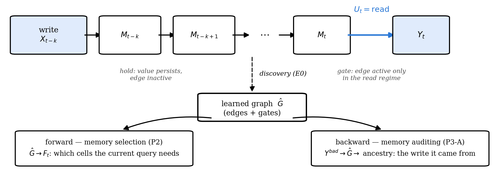
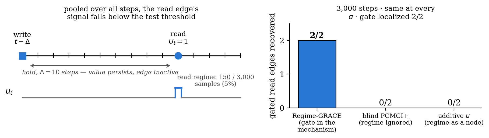
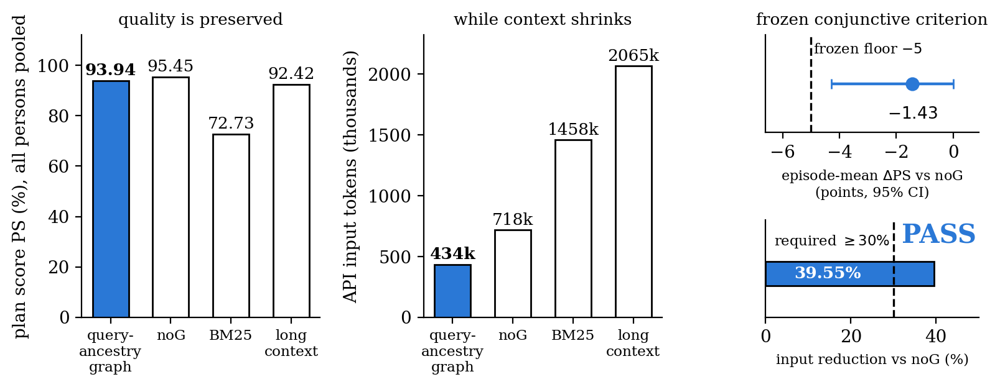
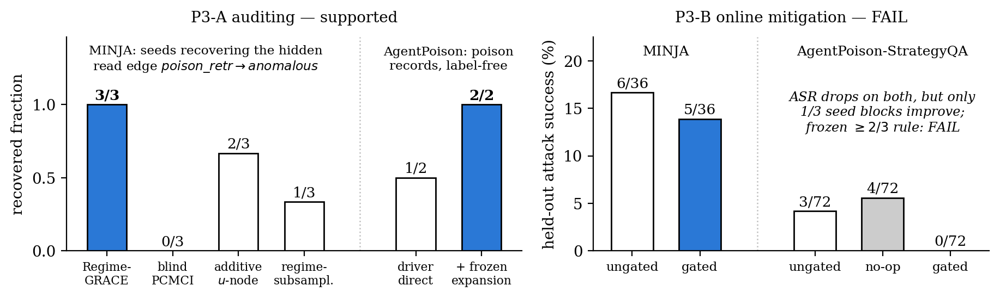
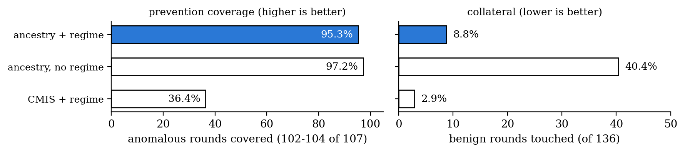

# Causal Memory — Round 1 results (2026-08-30)

Document version of the meeting deck `slides/8-30-yujia.pptx`; same content and
numbers, readable without the slides. Figures are the deck's figures.

**Summary.** Memory = write → hold → regime-gated read (Layer 1, observed). One
learned graph has two uses: forward memory selection and backward auditing.
Round 1 is complete and frozen ("frozen" = criterion, IDs and seeds fixed before
any output existed):

- E0 simulation — gated-edge recovery: **supported**
- P2 MemoryArena — compact memory: **PASS** (frozen criterion)
- P3-A auditing — **supported**, with boundaries
- P3-B online mitigation — **FAIL** (kept)

Open for this meeting: the v0.2 formulation, the samples definition, the scaling
simulation, and the venue. Six concrete decisions are at the end.

---

## 1 · The object



A write at step t−k enters memory; the value persists through the hold segment
while its edges stay inactive; at a read step (Uₜ = read) the gated edge to the
output opens. Discovery (E0) recovers this structure as a graph Ĝ with per-edge
gates. The same graph selects memory for the current query (forward, P2) and
traces a bad output to the write that caused it (backward, P3-A).

## 2 · Your 8/15 questions → v0.2

| You asked | v0.2 answer |
|---|---|
| How many variables can GRACE handle? | ~100 for the GRACE path; round 1 stays far under it (section 4) |
| What is a variable, at what granularity? | Xₜ = fixed-schema semantic slots; unwritten slots persist (Xₜ = Xₜ₋₁); vector-valued slots allowed — one of the three definitions you listed |
| What is a sample — how many per variable? | sample = one episode (independent trial); effective samples counted per edge × lag × regime |
| What does the graph learn / how does it act on memory? | input (X, U) → graph + per-edge gates; forward it picks what memory to keep, backward it gives the ancestry of a bad output |
| Trustworthiness or downstream benefit? | downstream score is primary; trustworthiness is the second use of the same graph |

## 3 · The formulation (Layer 1)

Variables: Xₜ = (Xₜ¹ … Xₜᵈ) semantic slots, observed · Uₜ ∈ {write, hold, read}
· Yₜ the output.

```
x_j(t) = Σ_i Σ_{l=0..K} [ a_ijl · g_ijl(u_t) ] · x_i(t−l)  +  ε_j(t)
```

l = 0 is the within-step term, l ≥ 1 the cross-step dependency (the two
functions you asked for on 7/29). Hold: an unwritten slot copies itself.

The gate multiplies the coefficient. A linear-additive uₜ-node only shifts the
mean per regime, so it misses gated edges. A CD-NOD-style nonparametric
surrogate could detect them; our round-1 baselines are the linear version.

**Estimator (Regime-GRACE).** Fit each regime separately; an edge is reported
when significant in any regime; it is gated when its per-regime coefficients
differ ≥ 4×. Two instantiations ran in round 1: GRACE on per-regime multi-trial
subsamples (P2's slot graph) and per-regime ridge + BH-FDR at α = 0.01 (E0,
MINJA). Instrumented within-step order constrains lag-0 direction.

**Layer 2** is the same object over latent state ("what the agent is
thinking"). Round 1 is entirely Layer 1.

## 4 · Scale

Round 1 is small: E0 has 8 variables, P2 has 7 slot types (× lag ≤ 3, learned
from 260 episodes), MINJA has 6 binary event channels — all far under GRACE's
~100-variable ceiling; the grouping fallback was never needed. The ceiling
belongs to the GRACE path (which ran P2's slot graph); the ridge instantiation
(E0, MINJA) is bounded by samples per regime rather than a variable cap.

**Missing:** the simulation you called mandatory on 8/21 — SCM/MLP-generated
data with known ground truth, recovery scored by SHD/F1 — at the scale from
7/29 (up to ~5,000 dimensions).

**Round-2 proposal (runs on your sign-off):** d ∈ {50, 200, 1,000, 5,000} ·
MLP mechanisms · sparse lag-k graphs with a regime-gated edge subset · SHD/F1
vs d for Regime-GRACE, blind PCMCI+, linear-additive u, and a CD-NOD-style
nonparametric surrogate · grouping above the ceiling, reported as its own
curve.

## 5 · Part 1 — pooling hides gated edges (E0)



On the synthetic write–hold–read SCM (read regime active on 150 / 3,000 steps),
read-edge recovery out of 2, identical at every hold noise σ ∈ {0, 0.01, 0.1}:

| method | read edges recovered | gate localized |
|---|---:|---:|
| Regime-GRACE (gate in the mechanism) | **2/2** | 2/2 |
| blind PCMCI+ (regime ignored) | 0/2 | — |
| additive u (regime as a node) | 0/2 | — |

Sample-size diagnostic: give the blind fit more data and it does detect the
edges — 0/2 at 3,000 steps, 1/2 at 12,000, 2/2 at 60,000 — but at every size it
leaves the gate unlabeled, because a pooled coefficient cannot depend on uₜ.
The additive surrogate follows regime frequency: 0/2 on E0 (active 5% of
steps), 2/3 on MINJA (69%).

**Detection is a sample-size issue; the gate is a model-class issue.**

## 6 · Part 2 — same graph, forward: compact memory (PASS)



MemoryArena travel, new frozen held-out IDs 111–120, graph learned with those
IDs excluded, four arms sharing model / decoder / steps / tools:

| arm | PS (%) | SPS (%) | SR | API input tokens | est. cost |
|---|---:|---:|---:|---:|---:|
| **query-ancestry graph** | 93.94 | 99.35 | 70% | **434,162** | **$4.30** |
| noG (same memory, no graph) | 95.45 | 99.48 | 80% | 718,215 | $5.11 |
| BM25 | 72.73 | 91.91 | 30% | 1,458,020 | $15.31 |
| long context | 92.42 | 98.70 | 80% | 2,064,625 | $8.20 |

Frozen criterion (episode-mean units): PS loss vs noG ≤ 5 points AND input
reduction ≥ 30%. Measured: −1.43 points (95% CI [−4.29, 0.00]) and −39.55% →
**PASS**. Against BM25 the same arm is +19.8 PS points at −70% input. Pooled
person-level deltas run slightly larger (−1.52; +21.21; +1.52) because episodes
differ in person count.

Boundary: graph selection and compact serialization are bundled; the adjacency
mask alone is not isolated.

## 7 · Part 3 — same graph, backward: auditing works, online defense does not



**Auditing (P3-A) — supported.** On MINJA, Regime-GRACE recovers the hidden
read edge poison_retr → anomalous in 3/3 seeds (gated 2/3) and provenance
traces each back to its write round. On AgentPoison-StrategyQA, the label-free
driver recovers 1/2 poison records directly and 2/2 after the frozen
embedding-cluster expansion (precision 100%). Discovery baselines on the same
traces: blind PCMCI 0/3, additive u-as-node 2/3, regime-subsampled 1/3.

**Online mitigation (P3-B) — FAIL, kept.** A separate later run. Held-out
attack success: MINJA 6/36 → 5/36; AgentPoison 3/72 → 0/72 (no-op 4/72). ASR
drops on both carriers, but each has only 1/3 seed blocks improving, so the
frozen ≥2/3 rule fails.

Caveats in one line: MINJA's event channel is oracle-tagged (is_poison), and
AgentPoison recovery had no pre-registered standalone PASS.

## 8 · What we need from you

1. **Formulation** — build the paper on write → hold → regime-gated read?
2. **Samples** — does per-edge × lag × regime counting settle the sample
   question? (Episodes count as independent trials; the alternative is the
   amortized cross-episode estimator.)
3. **Scale** — run the d = 50 → 5,000 simulation as round 2?
4. **Boundaries** — how much unbundling before submission? (P2's
   selection+serialization bundle · MINJA's oracle tag)
5. **P3-B** — keep the FAILs and stop, or run the drafted round 3? (2/3
   AgentPoison blocks had zero attacks to prevent, so the ≥2/3 rule was
   unsatisfiable there.)
6. **Venue** — which deadline? ICLR 2027: abstract Sep 18 / paper Sep 25, 2026
   (AOE, per iclr.cc).

Only 3 and 5 need new runs.

---

## Appendix A · P2: from PS = 0% to a frozen PASS

- **IDs 1–5 (original protocol):** PS 0.00% on both graph arms — reproduced
  exactly in the pre-registered rerun. Cause: the strict full-plan denominator
  (SPS 96.9% while one wrong slot fails the whole person); scorer and parsing
  verified clean.
- **Failure audit:** 31/37 persons failed only on slots the query never asked
  to change → deterministic query-target/base-inheritance decoder (no gold
  access, no evaluator in the loop).
- **Same IDs, exploratory:** learned arm 100% PS online; learned−pure +18.69
  points [+12.86, +28.33]. Labeled exploratory repair — developed after seeing
  the failures, so it stayed outside the confirmatory record.
- **IDs 101–110 (held-out):** main judgement PASS — pure−BM25 +16.55 [+9.17,
  +25.24], W/T/L 8/2/0. The graph/noG secondary condition FAILED: input −14.7%
  against the frozen 30%.
- **Diagnosis:** context compression outpaced API-input compression (shared
  system/tool schema and ReAct history dominate) → compact target-delta
  serialization v3, frozen on dev IDs 101–103 only.
- **IDs 111–120 (new frozen round):** −1.43 PS / −39.55% input → **PASS**.

## Appendix B · MINJA per-seed detail and boundaries

Replication (3 seeds, 243 rounds):

| seed | held-out ASR | decisive note-free ∧ poison-retrieved | edge |
|---:|---:|---:|---|
| 0 | 6/12 | 12/37 = 0.324 | found, gated |
| 1 | 1/12 | 6/31 = 0.194 | found, gated |
| 2 | 1/12 | 4/8 = 0.500 | found, without gate flag |

Aggregate: ASR 8/36 = 0.222 (Wilson [0.117, 0.381]); decisive 22/76 = 0.289
(Wilson [0.200, 0.400]); note-free control 0/77. Seed-0 read coefficient: 0.77
in-regime (p = 2.9e-6) vs 0.02 outside (p = 0.85). The 6/36 in section 7 is the
later P3-B mitigation round's own ungated arm — a separate run from this 8/36.

Boundaries on the claim: poison_retr is built from the record's is_poison tag,
so the recovered structure sits on an oracle-tagged event channel and MINJA
record discovery stays outside the claim; lag-0 orientation comes from the
instrumented retrieve-before-act order; seed heterogeneity is real (6/12 vs
1/12). MemAudit reproduction scores CMIS macro AUC 0.866 / precision@k 0.874;
our claim is temporal ancestry plus one-graph-two-uses.

## Appendix C · The regime condition in the replay gate



| gate | prevention coverage | collateral (benign touched) |
|---|---:|---:|
| ancestry + regime | 95.3% (102/107) | 8.8% (12/136) |
| ancestry, no regime | 97.2% (104/107) | 40.4% (55/136) |
| CMIS + regime | 36.4% (39/107) | 2.9% (4/136) |

Dropping the regime condition keeps coverage (+2 rounds) while touching 43 more
benign rounds. Coverage counts on saved trajectories, zero LLM re-invocation —
a policy-design signal; the online test of the same idea is P3-B, which failed.

## Appendix D · Why P3-B failed; the drafted round 3

**Power audit (diagnostic only).** AgentPoison: seed blocks 0 and 2 had ungated
0/24 — zero attacks to prevent — so "≥2/3 blocks improve" was unsatisfiable
with one evaluable block; conditional on evaluability the gate went 1/1 with 3
touched preventions and 0 reverse triggers. This FAIL is mostly the acceptance
rule. MINJA is a genuine limitation: ~55% of memory records never surfaced in
calibration retrieval (poison-recall cap 0.24–0.39), and untouched controls
flip answers at the size of the measured effect (clean-gated changed 10/24
answers while deleting zero retrievals).

**Round-3 draft (freezes only after sign-off).** A-priori evaluability (a block
counts only with ungated attacks ≥ 3; ≥ 3 evaluable blocks by construction,
predicted from earlier rounds' ungated ASR only); exposure (calibration ≥ 40
eligible trigger rounds + the frozen embedding-cluster expansion already
validated on AgentPoison, recall 0.50 → 1.00); noise (primary endpoint becomes
touched-only net prevention against a pre-registered flip-rate floor; block ASR
turns secondary). Round-2 verdicts stay pass=false whatever round 3 finds.

---

## Sources

- `docs/HANDOFF.md` — authoritative state page
- `results/regime_grace_e0.json` — E0 frozen result
- `results/diagnostics/e0_blind_power_sweep.json` — sample-size diagnostic
  (2026-08-30; changes no verdict)
- `results/real/p2_compact_v3/round_summary.json` — P2 frozen round (both delta
  units)
- `results/real/minja_replication_summary.json` ·
  `results/real/minja_online_gate_summary.json`
- `results/real/p3_agentpoison_round2/summary.json` ·
  `results/real/p3b_power_audit.json`
- `results/real/causal_gate_v2.json` — replay-only gate coverage
- `docs/p3b-round3-preregistration-draft-2026-08-30.md` — round-3 draft (unrun)
- Meeting transcripts: `meeting/script_extracted/` (7/29, 8/15, 8/21)
- ICLR 2027 CFP: iclr.cc (abstracts Sep 18, papers Sep 25, 2026 AOE)
